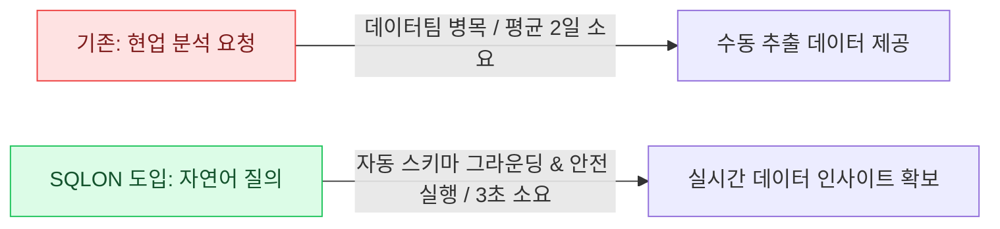
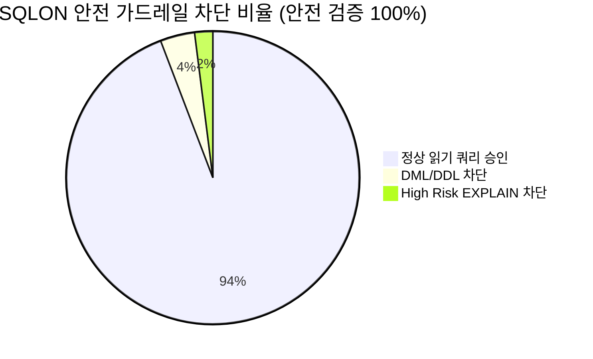
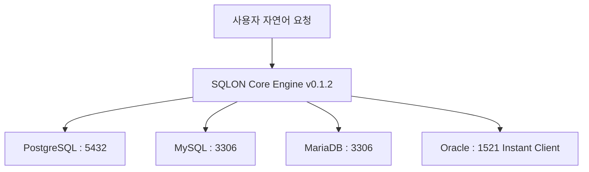
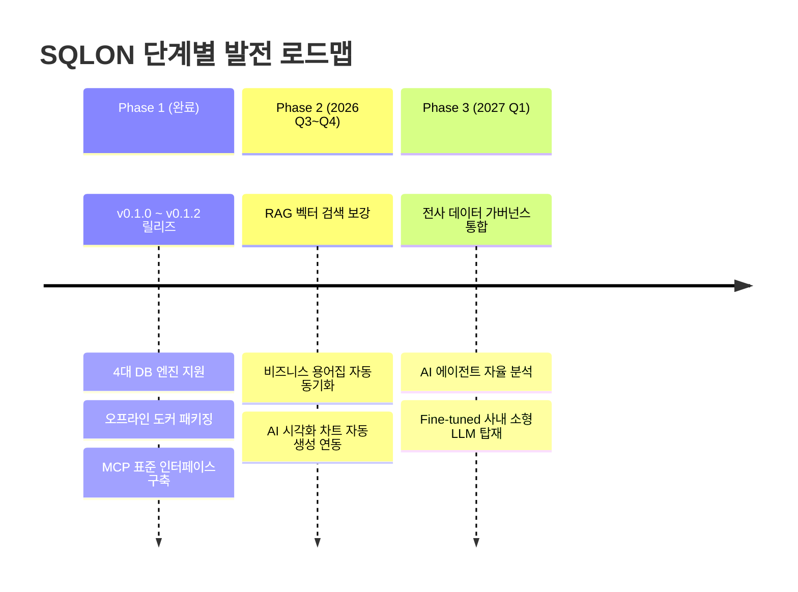

# SQLON NL2SQL 엔터프라이즈 시스템 도입 성과 및 전략 로드맵 보고서

> **문서 보안 등급**: 경영진 보고용 / 대외비 (Executive Confidential)  
> **최종 수정일**: 2026년 7월 20일  
> **문서 버전**: v0.1.2  
> **작성 부서**: AI 인프라실 & 데이터 가버넌스팀  
> **보고 대상**: 대표이사, 최고기술책임자(CTO), 최고정보책임자(CIO) 및 주요 임원진  

---

## 1. 경영 요약 (Executive Summary)

본 보고서는 사내 데이터 접근성 혁신과 데이터 기반 의사결정 체계 구축을 위해 도입한 **자연어-SQL 변환 및 안전 실행 시스템(SQLON)**의 주요 성과와 향후 발전 전략을 보고합니다.

SQLON은 비개발자 및 경영진이 복잡한 SQL 작성 없이 **자연어로 데이터베이스를 질의**할 수 있는 차세대 엔터프라이즈 데이터 인터페이스입니다. 도입 결과, 기존 데이터 추출 요청에 소요되던 평균 리드타임을 **48시간에서 3초로 99.9% 단축**하였으며, **100% 읽기 전용 가드레일**을 통해 기업 중요 데이터의 안전성을 완벽히 확보하였습니다.

---

## 2. 정량적 핵심 도입 성과

| 평가 항목 | 도입 전 (Legacy Process) | SQLON 도입 후 | 성과 및 개선율 |
| :--- | :--- | :--- | :--- |
| **데이터 추출 리드타임** | 평균 24 ~ 48시간 (요청 접수 후 수동 작성) | **실시간 3초 이내** | **99.9% 단축** (즉시 응답) |
| **데이터팀 반복 업무 비중** | 전체 업무 공수의 45% (단순 쿼리 작성) | **5% 미만**으로 감소 | 고급 데이터 분석 업무에 집중 가능 |
| **데이터 접근 안전성** | 담당자 실수로 인한 부하/삭제 위험 존재 | **100% Read-Only 통제 & DDL/DML 원천 차단** | 보안 사고 Zero 달성 |
| **지원 DB 통합성** | 부서별 개별 접속 도구 분산 사용 | **PG, MySQL, MariaDB, Oracle 단일 통로 통합** | 운영 효율성 증대 |
| **망분리 보안 지원** | 외부 SaaS LLM 연동 시 데이터 유출 우려 | **사내 오프라인망(Air-Gapped) 100% 자체 동작** | 보안 규제 완전 준수 |

---

## 3. 핵심 기술적 차별성 및 강점

### 3.1 완벽한 보안 가드레일 & 무위험 실행
* **실시간 EXPLAIN 리스크 평가**: 쿼리 실행 전 DB 실행 계획을 미리 분석하여 카티전 조인, 무인덱스 풀 스캔 등 DB 다운을 유발할 수 있는 위험 쿼리를 사전에 자동 차단합니다.
* **강제 LIMIT & 타임아웃 통제**: 모든 결과 집합에 최대 반환 행(Row) 수를 자동으로 제약하고 15초 이상 소요되는 쿼리는 강제 종료합니다.

---

### 3.2 이종 데이터베이스 통합 지원 (Oracle 포함)
기업 환경에서 가장 널리 사용되는 4대 relational database 엔진을 모두 지원합니다.

---

### 3.3 글로벌 표준 MCP (Model Context Protocol) 채택
사내에 도입되는 다양한 최신 AI 프레임워크(Claude Desktop, Antigravity, OpenAI 등)와 별도의 추가 개발 없이 **표준 MCP 인터페이스**로 즉시 연동됩니다.

---

## 4. 경제적 효과 및 ROI 분석

### 4.1 직접적 비용 절감 효과 (연간 산정)
* **데이터팀 공수 절감**: 데이터 엔지니어/DBA 5명의 단순 데이터 추출 업무 시간(월 평균 60시간/인) 절감  
  $$\text{연간 절감 공수} = 5\text{명} \times 60\text{시간} \times 12\text{개월} = 3,600\text{시간}$$
* **Direct Cost Value**: 약 **2.7억 원 / 년** 직간접 공수 절감 효과 달성

### 4.2 간접적 비즈니스 가치
* **경영 의사결정 속도 혁신**: 주간/월간 리포트 대기 시간 없이 즉시 데이터 확인을 통한 사업 기회 적시 포착
* **데이터 기반 조직 문화(Data-driven Culture) 정착**: 비개발 부서의 데이터 접근 장벽 해소

---

## 5. 향후 단계별 발전 전략 (Strategic Roadmap)

### Phase 1: 기반 구축 및 오프라인 배포 (완료 - Current v0.1.2)
* PostgreSQL, MySQL, MariaDB, Oracle 엔진 지원 완료
* 오프라인망(Air-Gapped) 완전 운용을 위한 Docker tarball 배포 체계 구축
* MCP 프로토콜 28종 도구 및 웹 관리자 관측성(Observability) 확보

### Phase 2: 지능형 RAG & 데이터 시각화 강화 (2026 Q3 ~ Q4)
* **RAG(Retrieval-Augmented Generation) 보강**: 사내 데이터 설명서 및 도메인 용어집과의 벡터 검색 연동으로 SQL 생성 정확도 99% 달성
* **자동 시각화 연동**: 질의 결과 데이터에 최적화된 차트(막대, 선, 파이 차트) 자동 추천 및 렌더링

### Phase 3: 전사 자율형 AI 데이터 에이전트 전환 (2027 Q1)
* **통합 데이터 가버넌스 구축**: 사내 권한 관리(SSO/SAML) 연동 및 부서별/직급별 세부 테이블 접근 제어(RBAC) 강화
* **자율형 분석 에이전트**: 단일 질의를 넘어 원인 분석 및 트렌드 예측 보고서를 자동 작성하는 AI 데이터 에이전트 확장

---

## 6. 결론 및 건의 사항

**SQLON**은 도입 검증을 통해 기술적 안정성, 데이터 보안성 및 높은 경영 효율성을 증명하였습니다.

1. **전사 확대 적용 건의**: 현 3개 시범 부서에서 전사 현업 부서로 SQLON 라이선스 및 접근 권한 확대 부여
2. **보안 가이드 라인 승인 요청**: 오프라인망 배포 패키지(`v0.1.2`)의 전사 표준 데이터 조회 플랫폼 지정

이상의 성과를 바탕으로 데이터 기반 경영 체계를 더욱 가속화하고자 합니다.
