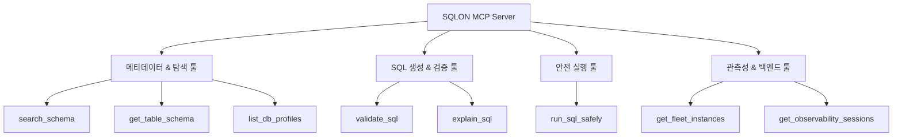

# SQLON MCP (Model Context Protocol) 툴셋 및 작동 원리 분석서

> **문서 보안 등급**: 사내 공유 가능 (Internal Technical Document)  
> **최종 수정일**: 2026년 7월 20일  
> **문서 버전**: v0.1.2  
> **작성 부서**: AI 인프라실  

---

## 1. 개요 및 MCP 프로토콜 채택 배경

**Model Context Protocol (MCP)**는 대규모 언어 모델(LLM) 에이전트와 외부 시스템(데이터베이스, 파일 시스템, API 등) 간의 인터페이스를 표준화하는 차세대 오픈 프로토콜입니다.

SQLON은 MCP 프로토콜을 구현하여 Claude Desktop, Antigravity CLI, VS Code AI extension 등 다양한 에이전트에서 데이터베이스 탐색, SQL 생성, 실행 검증 및 관측 기능을 제공합니다.

---

## 2. SQLON MCP 도구(Tool) 매핑 및 카테고리 분석

SQLON MCP 서버는 역할별로 최적화된 28개 도구를 제공합니다.

### 카테고리별 주요 MCP 도구 목록

| 카테고리 | 핵심 MCP 도구명 | 주요 기능 및 역할 |
| :--- | :--- | :--- |
| **메타데이터 탐색** | `search_schema` | 자연어 키워드 기반 연관 테이블/컬럼 탐색 |
| | `get_table_schema` | 테이블 스키마, 데이터 타입, Foreign Key 구조 조회 |
| | `list_db_profiles` | 연결된 DB 프로필(PG, MySQL, MariaDB, Oracle) 조회 |
| **SQL 생성 & 검증** | `validate_sql` | DB Dialect 기반 문법 정합성 및 안전성 검증 |
| | `explain_sql` | 실행 계획(EXPLAIN) 및 리스크 스코어링 분석 |
| **안전 실행** | `run_sql_safely` | Read-Only 권한 강제, LIMIT 부여 및 SQL 안전 실행 |
| **플릿 관측성** | `get_fleet_instances` | DB 인스턴스 연결 상태 및 헬스 체크 |
| | `get_observability_sessions` | 실시간 실행 세션 및 롱 러닝 쿼리 모니터링 |

---

## 3. 요약 및 시사점

SQLON MCP 도구 세트는 단순한 자연어-SQL 변환을 넘어, 엔터프라이즈 데이터베이스 보안 가드레일과 실시간 모니터링을 포함하는 종합 데이터 에이전트 레이어를 제공합니다.
