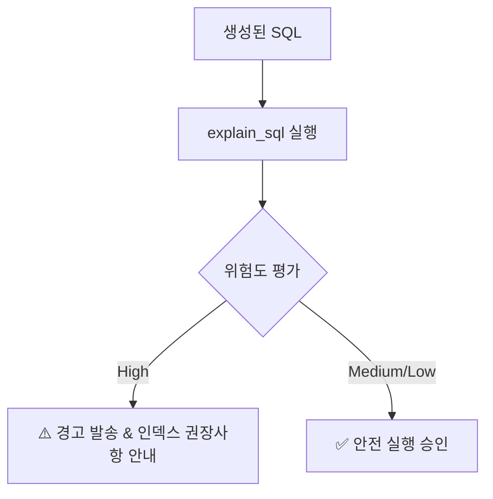

# SQLON NL2SQL & MCP 엔터프라이즈 사용자 가이드

> **문서 보안 등급**: 사내 공유 가능 (Internal Use Only)  
> **최종 수정일**: 2026년 7월 20일  
> **문서 버전**: v0.1.2  
> **대상**: 비즈니스 분석가, 데이터 엔지니어, 서비스 개발자 및 일반 사용자  

---

## 1. 문서 개요 & 시스템 소개

**SQLON**은 이종 데이터베이스(PostgreSQL, MySQL, MariaDB, Oracle) 환경에서 사용자가 자연어로 질의하면, 정확한 데이터베이스 스키마와 메타데이터를 기반으로 최적화된 SQL을 생성하고 안전하게 실행할 수 있도록 지원하는 **엔터프라이즈 자연어-SQL(NL2SQL) 및 MCP(Model Context Protocol) 서버**입니다.


### 주요 특장점
* **메타데이터 그라운딩(Metadata Grounding)**: 단임 테이블 정보뿐만 아니라 컬럼 설명, FK 관계, 인덱스 현황을 정밀 참조하여 환각(Hallucination) 없는 SQL을 생성합니다.
* **100% 읽기 전용 안전 가드레일**: 데이터 변경(INSERT, UPDATE, DELETE) 및 스키마 수정(DROP, ALTER)을 원천 차단하며, 자동 `LIMIT` 부여 및 타임아웃을 강제합니다.
* **실시간 EXPLAIN 리스크 분석**: 쿼리 실행 전 실행 계획을 사전 분석하여 대용량 풀 스캔(Full Scan)이나 카티전 조인(Cartesian Join) 등 DB 장애를 유발할 수 있는 위험을 사전 차단합니다.
* **글로벌 표준 MCP 지원**: Claude Desktop, Antigravity CLI, VS Code 등 다양한 사내 AI 에이전트와 매끄럽게 연동됩니다.

---

## 2. 시작하기 및 인터페이스 접속

SQLON은 웹 브라우저를 통한 **Web UI**와 AI 에이전트 연동을 위한 **MCP 프로토콜** 두 가지 접근 방식을 제공합니다.

### 2.1 Web UI 접속 방법
1. 사내 웹 브라우저(Chrome, Edge 등)를 실행합니다.
2. 지정된 SQLON 서비스 주소(`http://<서버IP>:6767`)에 접속합니다.
3. 상단 메뉴에서 대상 **DB 프로필(Profile)**을 선택합니다. (예: `pg_prod`, `mysql_analytics`, `oracle_erp`)

> [!NOTE]
> Web UI는 별도의 복잡한 설치 없이 브라우저에서 자연어 질의 입력, SQL 생성, 실행 결과 표 및 JSON 다운로드 기능을 모두 지원합니다.

### 2.2 MCP 클라이언트 (Claude Desktop / Antigravity CLI) 연동
사내 LLM 에이전트 환경의 `config.json` 파일에 SQLON MCP 서버를 등록하여 사용할 수 있습니다.

```json
{
  "mcpServers": {
    "sqlon": {
      "command": "sqlon",
      "args": ["-transport", "stdio", "-data", "/app/data/sqlon"]
    }
  }
}
```

---

## 3. 핵심 기능 및 사용법

SQLON은 사용자가 데이터를 안전하게 탐색하고 분석할 수 있도록 단계별 도구를 제공합니다.

### 3.1 스키마 및 메타데이터 탐색

자연어 질의 작성 시 대상 테이블의 정확한 구조를 모를 경우 스키마 탐색 도구를 활용할 수 있습니다.

| 도구 / 기능명 | 설명 | 비고 |
| :--- | :--- | :--- |
| `search_schema` | 키워드(예: '고객', '매출', '주문') 기반 관련 테이블 및 컬럼 검색 | 메타데이터 기반 연관도 추천 |
| `get_table_schema` | 특정 테이블의 컬럼 타입, PK/FK, Null 여부, 주석(Comment) 조회 | 스키마 정밀 파악 |
| `list_db_profiles` | 현재 연결 가능한 데이터베이스 프로필 목록 및 타겟 엔진 확인 | PostgreSQL, MySQL, MariaDB, Oracle |

> [!TIP]
> 질의 작성 전 `search_schema`를 실행하면 AI가 데이터베이스 메타데이터를 정밀 파악하여 한층 더 정확한 SQL을 생성합니다.

---

### 3.2 자연어 SQL 생성 및 검증

1. **질의 입력**: 사용자가 자연어로 원하는 데이터를 요청합니다.
   * *예시: "2026년 2분기 카테고리별 누적 매출 Top 5 및 고객수를 조회해줘."*
2. **SQL 구문 검증 (`validate_sql`)**: 생성된 SQL의 문법적 정합성 및 대상 DB 엔진(PostgreSQL, MySQL, MariaDB, Oracle) 고유 Dialect 부합 여부를 자동 체크합니다.

---

### 3.3 읽기 전용 안전 실행 (`run_sql_safely`)

생성된 SQL은 DB에 직접 실행되기 전 다음 가드레일을 통과해야 합니다.

> [!IMPORTANT]
> **SQLON 안전 실행 규칙**
> 1. **DML / DDL 금지**: `INSERT`, `UPDATE`, `DELETE`, `DROP`, `TRUNCATE`, `ALTER` 구문이 포함된 경우 즉시 실행 거부됩니다.
> 2. **자동 LIMIT 강제**: `LIMIT` 절이 누락된 경우 기본값(예: 100건~1,000건)이 자동 삽입됩니다.
> 3. **실행 시간 제한**: 지정된 타임아웃(기본 15초) 초과 시 쿼리가 자동 취소되어 DB 서버의 자원 독점을 방지합니다.

---

### 3.4 EXPLAIN 쿼리 실행 계획 및 리스크 분석 (`explain_sql`)

대용량 테이블을 조회할 때 발생할 수 있는 DB 성능 이슈를 사전에 방지하기 위해 실시간 리스크 분석이 수행됩니다.



* **High Risk**: 인덱스 미적용 대용량 테이블 풀 스캔(Full Table Scan), 조인 조건 누락(Cartesian Product)
* **Medium Risk**: 임시 테이블(Temporary Table) 생성 또는 파일 정렬(Filesort) 발생
* **Low Risk**: 적절한 Primary Key / Secondary Index 이용 조회

---

## 4. 실전 활용 시나리오 및 예시

### 시나리오 1: 기간별 매출 및 회원 통계 (PostgreSQL)
* **사용자 입력**: `"지난 달 신규 가입한 회원 중 10만원 이상 결제한 회원 수와 총 결제 금액을 알려줘."`
* **생성된 SQL**:
  ```sql
  SELECT 
      COUNT(DISTINCT u.user_id) AS new_vip_count,
      SUM(o.total_amount) AS total_spent
  FROM users u
  JOIN orders o ON u.user_id = o.user_id
  WHERE u.created_at >= DATE_TRUNC('month', CURRENT_DATE - INTERVAL '1 month')
    AND u.created_at < DATE_TRUNC('month', CURRENT_DATE)
    AND o.total_amount >= 100000
    AND o.status = 'COMPLETED';
  ```

---

### 시나리오 2: 상품 재고 및 출고 현황 (MySQL / MariaDB)
* **사용자 입력**: `"현재 재고가 10개 이하인 상품 목록과 해당 상품의 주 담당자 정보를 조회해줘."`
* **생성된 SQL**:
  ```sql
  SELECT 
      p.product_id,
      p.product_name,
      p.stock_quantity,
      m.manager_name,
      m.contact_email
  FROM products p
  LEFT JOIN product_managers m ON p.manager_id = m.id
  WHERE p.stock_quantity <= 10
  ORDER BY p.stock_quantity ASC
  LIMIT 100;
  ```

---

### 시나리오 3: 엔터프라이즈 계정 및 주문 이력 (Oracle)
* **사용자 입력**: `"2026년 기준 법인 고객별 주문 건수와 평균 주문 금액을 조회해줘."`
* **생성된 SQL**:
  ```sql
  SELECT 
      c.corp_name,
      COUNT(o.order_id) AS order_cnt,
      ROUND(AVG(o.order_price), 0) AS avg_order_price
  FROM corp_customers c
  JOIN corp_orders o ON c.corp_id = o.corp_id
  WHERE o.order_date >= TO_DATE('2026-01-01', 'YYYY-MM-DD')
  GROUP BY c.corp_name
  ORDER BY order_cnt DESC
  FETCH FIRST 100 ROWS ONLY;
  ```

---

## 5. 자주 묻는 질문 (FAQ) 및 장애 해결

> [!CAUTION]
> **자연어 질의 결과가 원하는 내용과 다를 때**
> * 테이블 및 컬럼명이 비즈니스 용어와 일치하지 않을 수 있습니다. 관리자에게 메타데이터 주석(Comment) 강화를 요청하시기 바랍니다.

| 현상 / 오류 메시지 | 원인 | 조치 방법 |
| :--- | :--- | :--- |
| `READ_ONLY_VIOLATION` | 입력한 질의에 수정/삭제/생성 구문 포함 | 조회(`SELECT`) 전용 질의로 재요청 |
| `QUERY_TIMEOUT` | DB 응답 시간(15초) 초과 | 조회 날짜 범위를 축소하거나 조건 추가 |
| `UNKNOWN_PROFILE` | 존재하지 않는 DB 프로필 선택 | `list_db_profiles`로 연결 가능한 DB 확인 |
